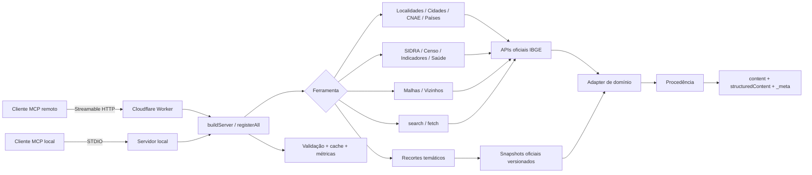
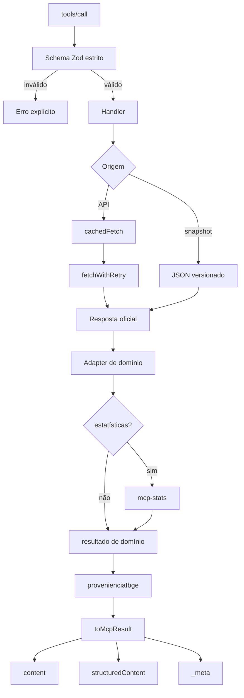

# CensoSenso MCP

[](#versao-e-estado)
[](#instalacao-local)
[](LICENSE)
[](https://github.com/hilaliskandar/hilaliskandar-censosenso-mcp/actions/workflows/ci.yml)

**Servidor MCP independente para consulta, comparação e análise de dados oficiais do IBGE, com 23 ferramentas, procedência reproduzível, validação de contratos e transporte remoto via Cloudflare Workers.**

**Endpoint MCP remoto:** `https://censosenso.poderdapalavra.org/mcp`

> **Protótipo público 1.** A versão 0.6.0 é experimental, somente leitura e disponibilizada sem SLA. O canal oficial inicial é o endpoint remoto acima. O pacote npm ainda não integra este lançamento.

O **CensoSenso MCP** é uma implementação de [Model Context Protocol](https://modelcontextprotocol.io/) voltada ao uso analítico de dados públicos brasileiros. A superfície atual reúne ferramentas de localidades, Censo Demográfico, SIDRA, indicadores, Cidades@, saúde, saneamento, economia, classificações, malhas administrativas, vizinhança municipal, recortes territoriais, notícias e calendário.

O princípio central é simples: uma resposta útil não deve trazer apenas um número. Sempre que o contrato da ferramenta permitir, o resultado preserva **fonte, URL reproduzível, período ou vintage, instante de extração, indicação de derivação e atributos de qualidade**.

---

## Sumário

1. [Versão e estado](#versao-e-estado)
2. [Validação dos 645 municípios paulistas](#validacao-dos-645-municipios-paulistas)
3. [Arquitetura](#arquitetura)
4. [Ferramentas disponíveis](#ferramentas-disponiveis)
5. [Fluxo de uma chamada](#fluxo-de-uma-chamada)
6. [Algoritmos e regras de decisão](#algoritmos-e-regras-de-decisao)
7. [Extração, cache e tolerância a falhas](#extracao-cache-e-tolerancia-a-falhas)
8. [Procedência e auditabilidade](#procedencia-e-auditabilidade)
9. [SIDRA e estatísticas](#sidra-e-estatisticas)
10. [Geografia, vizinhança e recortes territoriais](#geografia-vizinhanca-e-recortes-territoriais)
11. [Pesquisa assistida search/fetch](#pesquisa-assistida-searchfetch)
12. [Validação, testes e gates](#validacao-testes-e-gates)
13. [Instalação local](#instalacao-local)
14. [Uso remoto](#uso-remoto)
15. [Desenvolvimento e reprodução](#desenvolvimento-e-reproducao)
16. [Segurança, privacidade e limites operacionais](#seguranca-privacidade-e-limites-operacionais)
17. [Dados, licença e atribuições](#dados-licenca-e-atribuicoes)
18. [Status do protótipo e próximos passos](#status-do-prototipo-e-proximos-passos)

---

<a id="versao-e-estado"></a>
## Política de versionamento

A sequência pública usa versões pré-1.0: `0.x.0` para acréscimo funcional e `0.x.y` para correções ou melhorias de funcionalidades existentes. A família `0.9.x` é reservada ao beta e `1.0.0` ao primeiro lançamento estável. Consulte [docs/VERSIONAMENTO.md](docs/VERSIONAMENTO.md).

## Versão e estado

- versão do servidor: **0.6.0**;
- linguagem principal: **TypeScript**;
- runtime: **Node.js 22+**;
- protocolo: **Model Context Protocol**;
- transporte local: **STDIO**;
- transporte remoto: **Streamable HTTP**;
- hospedagem remota: **Cloudflare Workers**;
- endpoint: `https://censosenso.poderdapalavra.org/mcp`;
- health: `https://censosenso.poderdapalavra.org/health`;
- status: `https://censosenso.poderdapalavra.org/status`;
- licença do software: **MIT**;
- fonte principal dos dados: **IBGE**;
- natureza deste lançamento: **protótipo público experimental, sem SLA**.

A superfície 0.6.0 possui **23 ferramentas**: 21 componentes `ibge_*` e duas ferramentas genéricas de pesquisa assistida, `search` e `fetch`.


### Documentação técnica

- [Referência das 23 ferramentas](docs/FERRAMENTAS.md)
- [Exemplos de uso e casos de erro](docs/EXEMPLOS_E_CASOS_DE_ERRO.md)
- [Matriz de fontes, cache, derivação e limitações](docs/MATRIZ_FONTES_E_PROCESSOS.md)
- [Política de versionamento](docs/VERSIONAMENTO.md)
- [Notas da versão 0.6.0](docs/RELEASE_0_6_0.md)
- [Evidência da validação dos 645 municípios paulistas](docs/VALIDACAO_SP_645.md)
- [Como acessar os artefatos dos 645 municípios](docs/ACESSO_RESULTADOS_SP_645.md)
- [Segurança](SECURITY.md)
- [Privacidade](PRIVACY.md)
- [Contribuição](CONTRIBUTING.md)
- [Linhagem e atribuições](NOTICE.md)
- [Licenças de terceiros](THIRD_PARTY_LICENSES.md)

O deploy remoto foi homologado com a sequência MCP real:

1. `initialize`;
2. emissão/captura de `mcp-session-id`;
3. `notifications/initialized`;
4. `tools/list`;
5. `tools/call`;
6. consulta efetiva a fonte oficial;
7. retorno estruturado com procedência.

---

<a id="validacao-dos-645-municipios-paulistas"></a>
## Validação dos 645 municípios paulistas

A evidência completa desta execução está em [docs/VALIDACAO_SP_645.md](docs/VALIDACAO_SP_645.md). O resultado municipal público pode ser consultado em [validation/sp/0.6.0/municipios-sp-645.csv](validation/sp/0.6.0/municipios-sp-645.csv).


A versão 0.6.0 possui um gate reproduzível específico para o universo municipal do Estado de São Paulo.

Execução validada em **5 de outubro de 2026**:

| Métrica | Resultado |
|---|---:|
| Municípios retornados pela API oficial | **645** |
| Validação estrutural | **aprovada** |
| Divergências globais | **0** |
| Divergências municipais | **0** |
| Amostra determinística de chamadas reais | **21** |
| Amostra aprovada | **21/21** |
| Falhas na amostra | **0** |
| SHA-256 do snapshot validado | `a215de0ed21d5538db07a35e65c8dcd9fb1c201491c1ee1f4d0aaaa757810d86` |

O gate consulta:

```text
https://servicodados.ibge.gov.br/api/v1/localidades/estados/35/municipios?orderBy=nome
```

### O que é verificado nos 645 registros

Para cada município:

- código IBGE com exatamente 7 dígitos;
- prefixo `35`, correspondente ao Estado de São Paulo;
- unicidade dos códigos;
- nome não vazio;
- unicidade dos nomes normalizados em pt-BR;
- código da UF igual a 35, quando informado pela origem;
- sigla da UF igual a SP, quando informada;
- região igual a Sudeste, quando informada.

No conjunto:

- total obrigatório de 645 registros;
- inexistência de códigos duplicados;
- inexistência de qualquer registro marcado como divergente.

### Como a amostra de 21 municípios é construída

Além da validação estrutural 645/645, o gate cria uma amostra determinística para chamar as ferramentas reais do servidor.

A amostra começa por:

- município de São Paulo;
- Guararema;
- primeiro e último código na ordenação;
- primeiro e último nome na ordenação alfabética.

Depois inclui municípios nos quantis de código:

- 10%;
- 25%;
- 50%;
- 75%;
- 90%.

Também inclui:

- ao menos um município de cada região geográfica intermediária encontrada;
- um nome contendo caracteres acentuados;
- um nome composto com espaço.

As duplicidades são removidas por código e o resultado é ordenado deterministicamente.

Cada município da amostra é validado simultaneamente por:

```text
ibge_geocodigo(codigo=...)
ibge_localidade(codigo=...)
```

O gate compara código, nome e UF retornados pelas ferramentas com o registro oficial usado como referência.

### Artefatos produzidos pelo gate

A execução gera:

- `snapshot-candidato.json`;
- `meta.json`;
- `validacao-645.jsonl`;
- `amostra.json`;
- `amostra-resultados.json`;
- `resumo.json`.

O snapshot é serializado de forma determinística e recebe SHA-256. A promoção para snapshot versionado só é permitida se não houver divergência estrutural nem falha na amostra real.

Comando:

```bash
npm run gate:sp-645
```

---

<a id="arquitetura"></a>
## Arquitetura



A mesma lógica de registro das ferramentas é usada pelo servidor STDIO e pelo Worker HTTP. O Worker acrescenta controles de transporte, segurança e operação, mas não mantém uma implementação paralela das regras de domínio.

### Árvore funcional

```text
src/
  server.ts                 registro MCP e instruções
  cache.ts                  cache TTL e metadata de extração
  retry.ts                  retry, timeout e erros upstream
  provenance.ts             adapter de procedência IBGE
  stats.ts                  adapter estatístico SIDRA
  pagination.ts             guarda de cursor
  validation.ts             validações compartilhadas
  tools/                    ferramentas de domínio
  data/recortes/            snapshots territoriais versionados

worker/
  src/                      transporte Cloudflare
  tests/                    testes do Worker
  scripts/                  smoke e testes HTTP
  wrangler.jsonc            configuração de deploy

scripts/
  gate-sp-645.mjs           validação dos 645 municípios de SP
  normalizar_recortes.py    ETL dos recortes territoriais
  smoke-mcp.mjs             smoke STDIO/HTTP
  run_integration_gate.ps1  contratos reais

tests/                      testes unitários e de integração
evals/                      avaliação de seleção de ferramentas
baselines/                  superfície MCP versionada
docs/                       arquitetura, auditorias e metodologia
```

---

<a id="ferramentas-disponiveis"></a>
## Ferramentas disponíveis

Para schemas, parâmetros, decisões, fontes e limitações ferramenta por ferramenta, consulte [docs/FERRAMENTAS.md](docs/FERRAMENTAS.md). Para a visão consolidada de origem, cache e derivação, consulte [docs/MATRIZ_FONTES_E_PROCESSOS.md](docs/MATRIZ_FONTES_E_PROCESSOS.md).


| Domínio | Ferramentas |
|---|---|
| Localidades | `ibge_estados`, `ibge_municipios`, `ibge_localidade`, `ibge_geocodigo` |
| SIDRA | `ibge_sidra`, `ibge_sidra_tabelas`, `ibge_sidra_metadados`, `ibge_pesquisas` |
| Censo e indicadores | `ibge_censo`, `ibge_indicadores`, `ibge_comparar`, `ibge_cidades` |
| Geografia | `ibge_malhas`, `ibge_malhas_tema`, `ibge_vizinhos` |
| Economia/classificações | `ibge_cnae` |
| Saúde e condições de vida | `ibge_datasaude` |
| Nomes | `ibge_nomes` |
| Países | `ibge_paises` |
| Informação corrente | `ibge_noticias`, `ibge_calendario` |
| Pesquisa assistida | `search`, `fetch` |

### Seleção recomendada

| Pergunta | Ferramenta |
|---|---|
| Panorama de um município | `ibge_cidades` |
| Censo por tema | `ibge_censo` |
| Série econômica/social conhecida | `ibge_indicadores` |
| Comparar localidades | `ibge_comparar` |
| Consultar tabela SIDRA | `ibge_sidra` |
| Descobrir tabela | `ibge_sidra_tabelas` |
| Inspecionar dimensões/classificações | `ibge_sidra_metadados` |
| Resolver nome/código IBGE | `ibge_geocodigo` |
| Geometria administrativa | `ibge_malhas` |
| Vizinhança municipal | `ibge_vizinhos` |
| Recorte territorial especial | `ibge_malhas_tema` |

---

<a id="fluxo-de-uma-chamada"></a>
## Fluxo de uma chamada



A política do projeto é recusar ambiguidades relevantes em vez de escolher silenciosamente uma interpretação plausível.

---

<a id="algoritmos-e-regras-de-decisao"></a>
## Algoritmos e regras de decisão

### 1. Validação territorial

`isValidIbgeCode` interpreta o tamanho do código:

- 1 dígito → região;
- 2 dígitos → UF;
- 7 dígitos → município;
- 9 dígitos → distrito.

Para municípios e distritos, os dois primeiros dígitos precisam corresponder a uma UF oficial conhecida.

### 2. Normalização de UF

Entradas como:

```text
SP
São Paulo
35
```

são resolvidas por um único resolver compartilhado, evitando lógicas divergentes entre ferramentas.

### 3. Resolução em `ibge_geocodigo`

Quando recebe `codigo`, a ferramenta remove caracteres não numéricos e decide o nível territorial pelo comprimento.

Quando recebe `nome`:

1. verifica correspondência com UF;
2. verifica correspondência com região;
3. consulta municípios;
4. restringe por UF, quando informada;
5. usa busca textual por inclusão do nome;
6. limita a 20 correspondências;
7. se houver exatamente uma correspondência, retorna imediatamente a hierarquia detalhada;
8. se houver várias, retorna lista e exige escolha explícita.

A ferramenta não usa correspondência fuzzy probabilística para inventar uma localidade.

### 4. Datas

Entradas aceitas:

- `DD/MM/AAAA`;
- `DD-MM-AAAA`;
- `AAAA-MM-DD`.

A ordem mês-dia-ano fornecida pelo usuário não é aceita por ser ambígua no contexto brasileiro.

Quando uma API do IBGE exige `MM-DD-AAAA`, a conversão é feita somente depois da validação da entrada.

### 5. Períodos SIDRA

São aceitos, entre outros:

- `last`;
- `first`;
- `all`;
- `last N`;
- ano `AAAA`;
- intervalo `AAAA-AAAA`;
- mês `AAAAMM`;
- trimestre no formato usado pelo SIDRA;
- múltiplos períodos separados por vírgula.

### 6. Paginação MCP

As listas MCP atuais são entregues em página única e não emitem `nextCursor`.

Por isso, se o cliente envia `cursor` em:

- `tools/list`;
- `resources/list`;
- `resources/templates/list`;
- `prompts/list`;

o servidor responde JSON-RPC `-32602 Invalid params`, em vez de ignorar um cursor inválido.

### 7. Algoritmos delegados

Alguns algoritmos não são reimplementados localmente:

- estatística genérica → `@sbissoli/mcp-stats`;
- ranking do índice `search` → `@sbissoli/mcp-search`;
- modelo canônico de procedência → `@sbissoli/mcp-provenance`;
- contiguidade topológica → `@turf/boolean-touches`;
- centróide → `@turf/centroid`;
- distância geodésica → `@turf/distance`.

O CensoSenso implementa os adapters, regras de decisão, seleção de colunas, tratamento de erros, fontes, schemas e contratos ao redor desses algoritmos.

---

<a id="extracao-cache-e-tolerancia-a-falhas"></a>
## Extração, cache e tolerância a falhas

### Cache

O cache é em memória por processo/isolate.

TTL padrão:

| Classe | TTL |
|---|---:|
| `STATIC` | 24 horas |
| `MEDIUM` | 1 hora |
| `SHORT` | 15 minutos |
| `REALTIME` | 1 minuto |

A chave de cache é construída com parâmetros:

1. parâmetros `undefined` são removidos;
2. nomes são ordenados lexicograficamente;
3. a representação `k=v` é concatenada à base.

Isso evita chaves distintas para a mesma consulta apenas por diferença na ordem dos parâmetros.

### Data real de extração

Cada entrada de cache preserva a data do **fetch real**.

Em cache hit:

- o valor pode ser servido novamente;
- `served_from_cache=true`;
- `retrieved_at` continua sendo o instante original de obtenção upstream.

Isso evita declarar como “extraído agora” um dado que foi obtido anteriormente.

### Retry

Padrão:

- máximo: **4 retries** além da tentativa inicial;
- atraso inicial: **2.000 ms**;
- multiplicador: **2**;
- atraso máximo: **16.000 ms**.

Fórmula:

```text
delay = min(initialDelay × multiplier^(attempt-1), maxDelay)
```

Status HTTP retryable:

```text
429, 500, 502, 503, 504
```

Também são considerados transitórios erros de rede como:

- `ECONNREFUSED`;
- `ECONNRESET`;
- `ETIMEDOUT`;
- `ENOTFOUND`;
- `EAI_AGAIN`;
- conexão recusada/resetada;
- timeout.

Cada tentativa recebe `AbortSignal` próprio e timeout configurável.

### Erros da fonte

Quando uma API devolve erro:

1. o código HTTP é preservado;
2. o corpo textual é lido;
3. páginas HTML de borda são descartadas;
4. JSON de erro é inspecionado por `message`, `mensagem`, `erro`, `error` ou `detail`;
5. espaços são normalizados;
6. o texto é truncado em 300 caracteres.

A intenção é devolver ao cliente a razão fornecida pela fonte — por exemplo, “nível territorial incompatível” — em vez de reduzir tudo a “HTTP 400”.

---

<a id="procedencia-e-auditabilidade"></a>
## Procedência e auditabilidade

O CensoSenso usa um adapter sobre `@sbissoli/mcp-provenance`.

Contexto:

- namespace: `io.github.hilaliskandar.censosenso`;
- locale: `pt-BR`;
- timezone: Brasília, UTC-03:00;
- modo padrão: `concise`.

A procedência pode ser emitida em três canais:

1. `structuredContent.provenance`;
2. `structuredContent.attribution`;
3. `_meta` namespaced.

O Markdown legível também pode receber rodapé compacto.

### Fontes registradas

Entre as fontes oficiais usadas:

- API de Localidades;
- SIDRA;
- API de Agregados;
- API de Nomes;
- API de Malhas;
- GeoFTP;
- API de Notícias;
- Projeções de População;
- CNAE;
- Calendário;
- Países;
- Pesquisas/Cidades@.

### Derivação

Regra:

- filtrar, paginar ou reserializar dado bruto → não é derivação estatística;
- calcular média, mediana, percentis, rankings ou agregações → resultado marcado como derivado e acompanhado de nota metodológica.

---

<a id="sidra-e-estatisticas"></a>
## SIDRA e estatísticas

### Fluxo recomendado

```text
ibge_sidra_tabelas
      ↓
ibge_sidra_metadados
      ↓
ibge_sidra
```

Wrappers especializados simplificam temas frequentes:

- `ibge_censo`;
- `ibge_indicadores`;
- `ibge_datasaude`;
- `ibge_comparar`;
- `ibge_cidades`.

### Estatísticas sobre o conjunto completo

Quando `estatisticas=true`, o cálculo ocorre **antes da paginação/truncagem**.

São produzidos:

- n;
- soma;
- mínimo;
- máximo;
- média;
- mediana;
- desvio-padrão;
- percentis;
- top;
- bottom.

Marcadores SIDRA excluídos da distribuição:

```text
-
..
...
X
```

Valores não numéricos também ficam fora de `n` e são contabilizados em `registrosSemValor`.

### Resolução de `agruparPor`

A coluna solicitada é resolvida nesta ordem:

1. correspondência exata sem diferença de caixa/acento;
2. aliases conhecidos;
3. correspondência parcial bidirecional;
4. se houver mais de uma candidata, a operação é recusada como ambígua.

Exemplos de aliases:

- `UF`, `estado` → `Unidade da Federação`;
- `cidade` → `Município`;
- `região` → `Grande Região`;
- `indicador` → `Variável`.

Quando SIDRA publica simultaneamente “Unidade da Federação” e “Unidade da Federação (Código)”, o rótulo legível é preferido porque os grupos são semanticamente equivalentes.

### Mistura de variáveis

Se uma consulta traz várias variáveis e o usuário não escolhe agrupamento, o servidor agrupa automaticamente por `Variável` para evitar calcular uma única distribuição sobre unidades potencialmente incompatíveis.

---

<a id="geografia-vizinhanca-e-recortes-territoriais"></a>
## Geografia, vizinhança e recortes territoriais

### Malhas administrativas

`ibge_malhas` consulta a API oficial de Malhas para geometrias administrativas.

### Vizinhança municipal

Sem `raio`:

```text
geometria do município
        ↓
candidatos territoriais
        ↓
@turf/boolean-touches
        ↓
municípios topologicamente contíguos
```

Neste modo, “vizinho” significa tocar a fronteira do município.

Com `raio`:

```text
geometria
   ↓
centroid
   ↓
distance
   ↓
filtro por km
```

Esse modo é aproximação por distância entre centróides e é declarado como tal.

### Recortes temáticos

A auditoria do projeto encontrou bloqueio HTTP 403 no WFS temático para clientes automatizados. Para evitar que uma origem instável fizesse parte do caminho crítico, os atributos e composições foram migrados para snapshots oficiais versionados.

Fluxo:

```text
fonte oficial IBGE/GeoFTP
        ↓
inspeção de arquivo
        ↓
validação de estrutura/vintage/encoding
        ↓
normalização
        ↓
JSON versionado
        ↓
recortes-gerados.ts
        ↓
ibge_malhas_tema
```

Recortes atualmente versionados:

- Amazônia Legal 2024;
- Biomas 2025;
- Semiárido 2022;
- Zona Costeira 2021;
- Faixa de Fronteira 2024;
- Regiões Metropolitanas 2025;
- RIDEs 2025.

A ferramenta retorna composição e atributos. Geometria administrativa continua em `ibge_malhas`.

---

<a id="pesquisa-assistida-searchfetch"></a>
## Pesquisa assistida search/fetch

O índice de pesquisa é construído na primeira chamada e agrega:

1. catálogo SIDRA;
2. municípios;
3. indicadores conhecidos;
4. temas do Censo;
5. indicadores de saúde;
6. recortes territoriais.

A construção consulta em paralelo:

- catálogo oficial de agregados;
- lista nivelada de municípios.

Depois acrescenta os dicionários auditados locais.

O índice possui TTL equivalente a `CACHE_TTL.STATIC` — 24 horas.

Chamadas simultâneas durante a primeira construção compartilham a mesma Promise, evitando reconstruções concorrentes.

Se a construção falha, o resultado falho não é mantido: a próxima chamada tenta novamente.

### `search`

O ranking genérico é fornecido por `@sbissoli/mcp-search`. O CensoSenso define:

- entradas;
- títulos;
- palavras-chave;
- URLs;
- vocabulário de consulta;
- fontes;
- limite de resultados.

### `fetch`

O ID do resultado determina qual ferramenta real renderiza o documento:

- tabela SIDRA → metadados SIDRA;
- município → hierarquia + população;
- tema Censo → catálogo auditado;
- saúde → indicador auditado;
- recorte → snapshot versionado;
- indicador geral → ferramenta de indicadores.

Assim, `fetch` não inventa um documento independente: ele recompõe a informação usando os mesmos adapters e contratos das ferramentas de domínio.

---

<a id="validacao-testes-e-gates"></a>
## Validação, testes e gates

O projeto separa testes determinísticos de contratos que dependem de fontes externas.

### Gate completo

```bash
npm run gate:deploy
```

Encadeia:

1. checagem do gerador de homologação;
2. typecheck;
3. lint;
4. EOL;
5. Prettier;
6. build;
7. suíte Vitest;
8. cobertura;
9. `npm ci` do Worker;
10. typecheck do Worker;
11. testes do Worker.

### Gate dos 645 municípios

```bash
npm run gate:sp-645
```

### Integração real

Em PowerShell:

```powershell
.\scripts\run_integration_gate.ps1
```

### Smoke

STDIO:

```bash
node scripts/smoke-mcp.mjs --stdio
```

Remoto:

```bash
node scripts/smoke-mcp.mjs https://censosenso.poderdapalavra.org
```

### Baseline da superfície MCP

```bash
node scripts/dump-surface.mjs --stdio
```

Baseline atual:

```text
baselines/surface-stdio-0.6.0.json
```

Mudança de ferramentas, schemas, resources ou prompts deve produzir diff explícito no baseline.

---

<a id="instalacao-local"></a>
## Instalação local

A árvore homologada do protótipo **0.6.0** está publicada neste repositório. O CI público usa apenas runners hospedados pelo GitHub e não realiza deploy de produção.

Pré-requisitos:

- Git;
- Node.js 22 ou superior;
- npm compatível com o lockfile;
- Python somente se for necessário regenerar snapshots territoriais.

Clone:

```bash
git clone https://github.com/hilaliskandar/hilaliskandar-censosenso-mcp.git
cd hilaliskandar-censosenso-mcp
npm ci
```

Build:

```bash
npm run build
```

Execução STDIO:

```bash
node dist/index.js
```

Ou:

```bash
npm start
```

Configuração genérica de um cliente MCP local:

```json
{
  "mcpServers": {
    "censosenso": {
      "command": "node",
      "args": ["/caminho/para/hilaliskandar-censosenso-mcp/dist/index.js"]
    }
  }
}
```

A forma exata do arquivo de configuração varia entre clientes MCP.

---

<a id="uso-remoto"></a>
## Uso remoto

Clientes compatíveis com MCP Streamable HTTP devem apontar para:

```text
https://censosenso.poderdapalavra.org/mcp
```

O protótipo público 1:

- não exige conta CensoSenso;
- não exige OAuth;
- não exige API key;
- é somente leitura.

### Exemplos de intenção

```text
Qual era a população de Campinas no Censo 2022?
Liste os municípios do Espírito Santo.
Compare a população de Campinas, Jundiaí e Sorocaba.
Quais municípios fazem fronteira com Guararema?
Qual é o índice de envelhecimento de Campinas?
Liste os municípios da Amazônia Legal.
```

### Exemplos de chamadas

```text
ibge_geocodigo(nome="Campinas", uf="SP")
ibge_censo(ano="2022", tema="estrutura_etaria", nivel_territorial="6", localidades="3509502")
ibge_vizinhos(municipio="3518305")
ibge_malhas_tema(tema="amazonia_legal")
```

---

<a id="desenvolvimento-e-reproducao"></a>
## Desenvolvimento e reprodução

Worker local:

```bash
cd worker
npm ci
npm run dev
```

A equivalência funcional de uma reprodução exige, no mínimo:

1. `npm ci`;
2. `npm run gate:deploy`;
3. negociação MCP via STDIO;
4. negociação MCP via Worker;
5. `tools/list` com superfície esperada;
6. ao menos uma chamada real ao IBGE;
7. procedência nos canais esperados;
8. integridade dos snapshots;
9. ausência de mudança inexplicada no baseline;
10. resposta válida de `/health`, `/status` e `/mcp`.

### CI/CD

Fluxo operacional:

```text
push/merge
   ↓
GitHub
   ↓
gates
   ↓
Cloudflare Workers Build
   ↓
wrangler deploy
   ↓
health/status/MCP
```

---

<a id="seguranca-privacidade-e-limites-operacionais"></a>
## Segurança, privacidade e limites operacionais

### Modelo de segurança

- ferramentas de dados são read-only;
- schemas de entrada são estritos;
- Host/Origin são validados no transporte;
- HTTPS via Cloudflare;
- Bearer opcional existe no código;
- OAuth não está habilitado;
- `/metrics` é privado por padrão.

Sem `METRICS_API_KEY`, `/metrics` responde:

```text
HTTP 404 Not Found
```

Esse comportamento foi confirmado no domínio de produção antes da abertura pública.

### Rate limiting

O Worker usa token bucket em memória por cliente/IP.

Configuração atual:

- burst: **20 tokens**;
- refill: **5 tokens/s**;
- máximo: **1.000 buckets por isolate**;
- evicção FIFO quando o mapa atinge o limite.

Importante: esse limite é por isolate. Não constitui cota global exata.

### Telemetria

O projeto pode manter:

- contadores agregados no Durable Object `USAGE`;
- logs de método, path, status e duração;
- metadata de deploy;
- cache em memória.

O código não foi projetado para persistir nos contadores de uso:

- valores de argumentos;
- conteúdo das perguntas;
- datasets retornados.

Leia [PRIVACY.md](PRIVACY.md) e [SECURITY.md](SECURITY.md).

### Limitações

- sem SLA;
- disponibilidade depende de APIs oficiais externas;
- o WFS temático permanece fora do runtime principal;
- rate limit não é global;
- OAuth ainda não está habilitado;
- pacote npm ainda não publicado;
- o protótipo pode mudar de contrato em versões posteriores.

---

<a id="dados-licenca-e-atribuicoes"></a>
## Dados, licença e atribuições

### Software

Licença: **MIT**.

Copyright:

```text
Copyright (c) 2026 Carlos Alexandre Gomes <hilaliskandar@gmail.com>
```

### Código de origem

Partes deste projeto derivam de:

**IBGE Brasil MCP / ibge-br-mcp**  
Autor original: **Sidney da Silva Pereira Bissoli**  
Repositório: `https://github.com/SidneyBissoli/ibge-br-mcp`  
Licença: MIT.

O aviso MIT original é preservado em [THIRD_PARTY_LICENSES.md](THIRD_PARTY_LICENSES.md).

A linhagem e as responsabilidades estão descritas em [NOTICE.md](NOTICE.md).

### Dados

O software consulta dados públicos oficiais do IBGE.

A licença MIT deste repositório cobre o **software** e não substitui os termos aplicáveis aos dados e serviços oficiais consultados.

O CensoSenso:

- não é produto oficial do IBGE;
- não representa o IBGE;
- não implica endosso do IBGE.

---

<a id="status-do-prototipo-e-proximos-passos"></a>
## Status do protótipo e próximos passos

Concluído:

- versão 0.6.0;
- 23 ferramentas;
- transporte STDIO;
- Streamable HTTP;
- domínio próprio;
- homologação remota;
- procedência estruturada;
- snapshots territoriais;
- CI/gates;
- hardening de `/metrics`;
- validação dos **645 municípios paulistas**;
- documentação de segurança e privacidade;
- licença e atribuições públicas.

Antes da divulgação ampla:

1. publicar a árvore homologada completa neste repositório;
2. executar novamente o gate completo na árvore pública;
3. executar smoke remoto após a migração;
4. criar tag/release pública;
5. iniciar com um grupo externo reduzido;
6. monitorar erros, uso e rate limiting;
7. ampliar a divulgação somente após janela inicial estável.

Itens deliberadamente posteriores:

- publicação npm;
- OAuth obrigatório;
- rate limit global rígido;
- eventual retorno do WFS temático ao runtime.

---

## Contato

**Carlos Alexandre Gomes**  
GitHub: [@hilaliskandar](https://github.com/hilaliskandar)  
E-mail: `hilaliskandar@gmail.com`

Para vulnerabilidades, consulte [SECURITY.md](SECURITY.md). Para contribuições, consulte [CONTRIBUTING.md](CONTRIBUTING.md).
