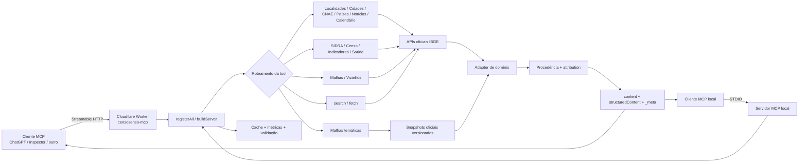
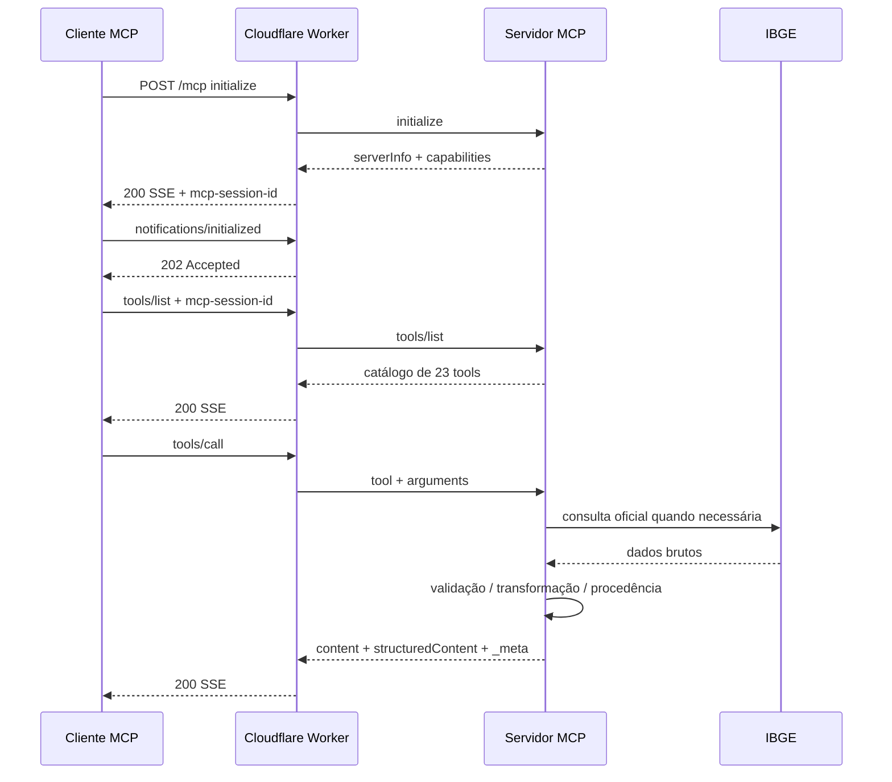
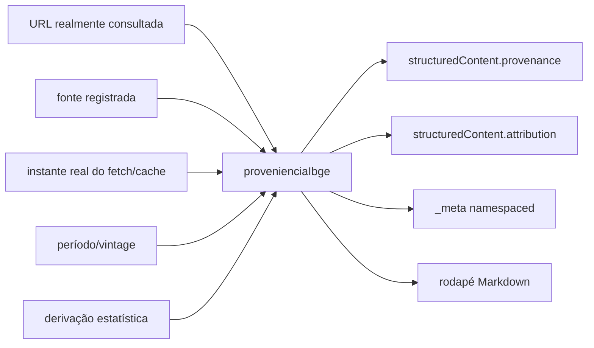
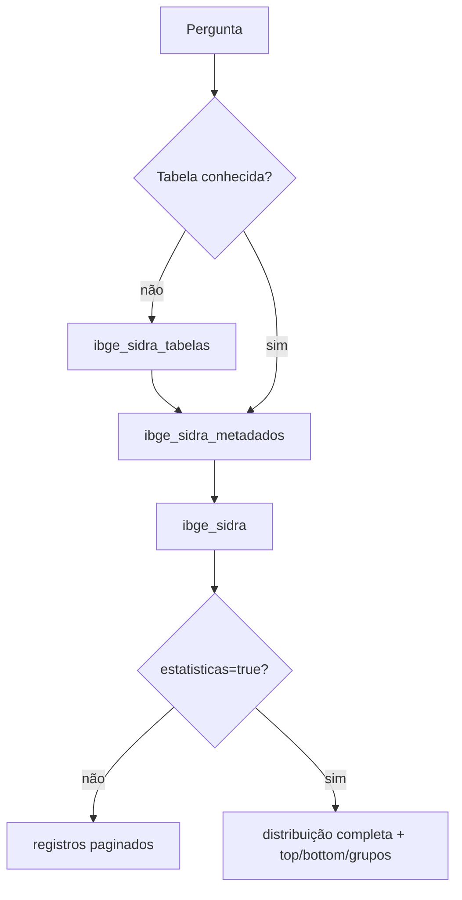
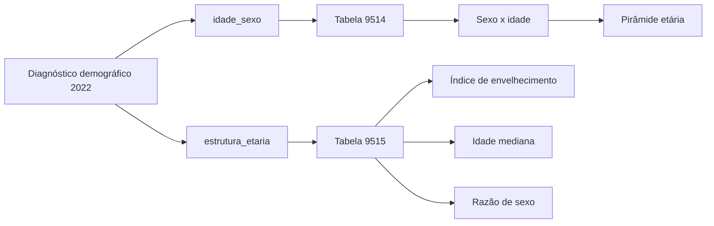
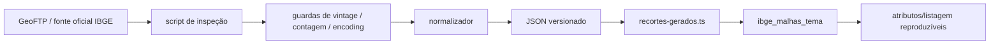
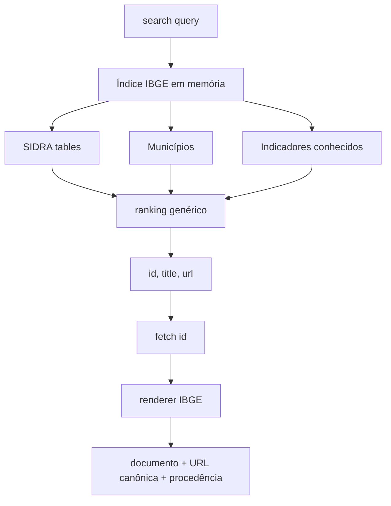

# Arquitetura, fluxo de dados e reprodução do CensoSenso MCP

## 1. Escopo

Este documento descreve o CensoSenso MCP 0.6.0 como sistema executável, não apenas como catálogo de ferramentas. O objetivo é permitir que uma pessoa, um agente de software ou uma auditoria automatizada compreenda:

- onde o servidor começa e termina;
- como uma requisição MCP percorre o sistema;
- quais componentes são locais e quais são externos;
- como dados do IBGE entram e são transformados;
- onde cache, snapshots, estatística e procedência atuam;
- como o servidor é testado;
- como a publicação no Cloudflare Workers é reproduzida;
- quais comandos devem ser usados para validar uma cópia independente.

## 2. Visão geral da arquitetura



## 3. Dois transportes, uma mesma superfície lógica

### 3.1 STDIO

Entrada:

```text
node dist/index.js
```

Uso principal:

- desenvolvimento local;
- clientes MCP que iniciam processos locais;
- captura determinística da superfície;
- comparação de baseline.

### 3.2 Streamable HTTP

Endpoint atual:

```text
https://censosenso.poderdapalavra.org/mcp
```

Health:

```text
https://censosenso.poderdapalavra.org/health
```

Status:

```text
https://censosenso.poderdapalavra.org/status
```

O Worker usa a mesma lógica de registro das ferramentas. A camada HTTP acrescenta:

- CORS;
- validação de Host/Origin;
- Bearer opcional;
- rate limiting;
- sessão MCP emitida no `initialize`;
- rotas de health/status;
- Durable Object para métricas simples;
- observabilidade Cloudflare.

## 4. Sequência do protocolo remoto



## 5. Fluxo interno de uma chamada

```mermaid
flowchart TD
    A[tools/call] --> B[Schema Zod estrito]
    B -->|inválido| C[Erro pedagógico / isError]
    B -->|válido| D[Handler da ferramenta]
    D --> E{Fonte}
    E -->|API| F[cachedFetch + retry]
    E -->|snapshot| G[recortes versionados]
    F --> H[Resposta oficial]
    G --> H
    H --> I[Adapter da ferramenta]
    I --> J{Modo estatístico?}
    J -->|sim| K[@sbissoli/mcp-stats]
    J -->|não| L[Dados de domínio]
    K --> L
    L --> M[provenienciaIbge]
    M --> N[toMcpResult]
    N --> O[Markdown]
    N --> P[structuredContent]
    N --> Q[_meta namespaced]
```

## 6. Canais de saída

Uma resposta bem-sucedida pode conter três canais complementares.

### 6.1 `content`

Texto legível por clientes simples e por usuários.

### 6.2 `structuredContent`

Objeto tipado segundo `outputSchema`.

Inclui, nas ferramentas de dados:

- dados do domínio;
- `provenance`;
- `attribution`.

### 6.3 `_meta`

Canal fora do texto principal. O namespace operacional atual é:

```text
io.github.hilaliskandar.censosenso/provenance
io.github.hilaliskandar.censosenso/attribution
```

O namespace é intencionalmente diferente do projeto de origem para que consumidores automáticos não confundam identidade operacional com linhagem histórica.

## 7. Procedência



O modelo canônico e a serialização vêm de `@sbissoli/mcp-provenance`. O adaptador local define:

- fontes IBGE;
- URL específica;
- regime jurídico;
- timezone de Brasília;
- citação;
- dataset;
- vintage;
- derivação;
- namespace CensoSenso.

## 8. Fluxo SIDRA



Wrappers de maior nível reduzem a necessidade de usar o motor SIDRA diretamente:

- `ibge_censo`;
- `ibge_indicadores`;
- `ibge_datasaude`;
- `ibge_comparar`;
- `ibge_cidades`.

## 8.1 Estrutura etária municipal no Censo 2022

O diagnóstico demográfico usa duas tabelas complementares:

- `ibge_censo(tema="idade_sexo")` → tabela 9514, variável 93, sexo Homens/Mulheres e todas as categorias de idade. É a base para construir a pirâmide etária.
- `ibge_censo(tema="estrutura_etaria")` → tabela 9515, variáveis 10612, 10613 e 8845. Retorna, respectivamente, índice de envelhecimento, idade mediana e razão de sexo.

Essas rotas não são substitutas: a 9514 fornece a distribuição; a 9515 fornece indicadores sintéticos publicados pelo IBGE.



## 9. Fluxo territorial

### 9.1 Malhas administrativas

`ibge_malhas` consulta a API oficial de Malhas para geometria administrativa.

### 9.2 Vizinhança municipal

```mermaid
flowchart TD
    A[municipio] --> B[Resolver código]
    B --> C[Carregar malha municipal]
    C --> D{raio informado?}
    D -->|não| E[@turf/boolean-touches]
    E --> F[municípios contíguos]
    D -->|sim| G[@turf/centroid]
    G --> H[@turf/distance]
    H --> I[municípios dentro do raio]
```

Sem raio, “vizinho” significa contiguidade topológica. Com raio, o resultado é aproximação por distância entre centróides e deve ser interpretado dessa forma.

## 10. Fluxo dos recortes temáticos

O WFS temático foi retirado do caminho crítico para atributos/listagens porque a auditoria encontrou bloqueio HTTP para clientes automatizados.



Temas versionados:

- Amazônia Legal 2024;
- Biomas 2025;
- Semiárido 2022;
- Zona Costeira 2021;
- Faixa de Fronteira 2024;
- Regiões Metropolitanas 2025;
- RIDEs 2025.

Os scripts de geração ficam em `scripts/`; os artefatos ficam em `src/data/recortes/`.

## 11. `search` e `fetch`

O contrato genérico é fornecido por `@sbissoli/mcp-search`; o adapter local define o universo IBGE.



## 12. Árvore funcional do repositório

```text
.
├── src/                         núcleo do servidor e ferramentas
│   ├── tools/                   implementações de domínio
│   ├── data/recortes/           snapshots oficiais versionados
│   ├── server.ts                registro MCP e instruções
│   ├── provenance.ts            adapter de procedência
│   ├── stats.ts                 adapter estatístico
│   └── ...
├── worker/                      transporte Cloudflare Workers
│   ├── src/
│   ├── tests/
│   ├── scripts/
│   └── wrangler.jsonc
├── tests/                       testes unitários, contrato e integração
├── evals/                       seleção semântica de ferramentas
├── scripts/                     geração, auditoria, smoke e gates
├── baselines/                   superfície MCP normalizada
├── docs/                        auditorias e documentação técnica
├── server.json                  manifesto MCP Registry
├── package.json                 fonte principal de versão/dependências
└── LICENSE
```

## 13. Ferramentas de desenvolvimento utilizadas

### Runtime e protocolo

- Node.js;
- npm;
- TypeScript;
- Model Context Protocol SDK.

### Schemas e validação

- Zod;
- JSON Schema emitido/validado pelo SDK.

### Testes

- Vitest;
- coverage V8;
- cliente MCP em memória;
- contratos de integração real condicionais;
- scripts de smoke HTTP/STDIO.

### Qualidade

- ESLint;
- Prettier;
- verificação explícita de EOL;
- baseline da superfície MCP.

### Geoprocessamento

- Turf `boolean-touches`;
- Turf `centroid`;
- Turf `distance`;
- scripts Python para inspeção/normalização de fontes territoriais.

### Hosting e CI/CD

- GitHub;
- GitHub Actions;
- Cloudflare Workers;
- Wrangler;
- Cloudflare Workers Builds;
- Durable Objects;
- Workers Version Metadata;
- observabilidade do Cloudflare.

## 14. Reprodução local

### 14.1 Pré-requisitos

- Git;
- Node.js 22 ou superior;
- npm compatível com o lockfile;
- Python apenas para regenerar os snapshots territoriais.

### 14.2 Instalação

```bash
git clone https://github.com/hilaliskandar/ibge-br-mcp-lab.git
cd ibge-br-mcp-lab
npm ci
```

### 14.3 Gate completo

```bash
npm run gate:deploy
```

Esse comando encadeia:

1. `typecheck`;
2. `lint`;
3. `format:check`;
4. `build`;
5. testes;
6. cobertura;
7. instalação reproduzível do Worker;
8. typecheck do Worker;
9. testes do Worker.

### 14.4 Execução STDIO

```bash
npm run build
node dist/index.js
```

### 14.5 Worker local

```bash
cd worker
npm ci
npm run dev
```

### 14.6 Smoke

STDIO:

```bash
node scripts/smoke-mcp.mjs --stdio
```

HTTP:

```bash
node scripts/smoke-mcp.mjs https://censosenso.poderdapalavra.org
```

## 15. Gate de integração real

Em Windows/PowerShell:

```powershell
.\scripts\run_integration_gate.ps1
```

Os testes marcados como integração são ignorados no gate unitário normal e habilitados explicitamente quando se deseja consultar origens reais.

Isso impede que indisponibilidade externa torne a suíte unitária não determinística, mas permite verificar contratos reais antes de marcos importantes.

## 16. Baseline de superfície

A superfície MCP é capturada por:

```bash
node scripts/dump-surface.mjs --stdio
```

Baseline atual:

```text
baselines/surface-stdio-0.6.0.json
```

A comparação de superfície detecta mudanças em:

- ferramentas;
- nomes;
- títulos;
- schemas;
- resources;
- prompts.

Versão do pacote é deliberadamente tratada separadamente para não poluir diffs de contrato.

## 17. CI/CD de produção

```mermaid
flowchart TD
    A[push / merge em main] --> B[GitHub]
    B --> C[Cloudflare Workers Builds]
    C --> D[npm ci]
    D --> E[npm run gate:deploy]
    E -->|falha| F[deploy bloqueado]
    E -->|passa| G[npm --prefix worker run deploy]
    G --> H[predeploy do worker]
    H --> I[wrangler deploy]
    I --> J[censosenso-mcp workers.dev]
    J --> K[/health]
    J --> L[/status]
    J --> M[/mcp]
```

Configuração de produção:

- repositório: `hilaliskandar/ibge-br-mcp-lab`;
- branch: `main`;
- root directory: `/`;
- build: `npm run gate:deploy`;
- deploy: `npm --prefix worker run deploy`;
- Worker: `censosenso-mcp`;
- endpoint MCP: `/mcp`.

## 18. Smoke remoto reproduzível

### 18.1 Health

```bash
curl -i https://censosenso.poderdapalavra.org/health
```

Esperado: HTTP 200 e `ok`.

### 18.2 Status

```bash
curl -i https://censosenso.poderdapalavra.org/status
```

Esperado: `status=ok`, `name=censosenso-mcp`, versão e metadata de deploy.

### 18.3 MCP

Fluxo mínimo:

1. `initialize`;
2. capturar `mcp-session-id`;
3. `notifications/initialized`;
4. `tools/list`;
5. `tools/call`.

O teste de homologação de 03/10/2026 executou uma chamada real de `ibge_geocodigo` para Campinas e recebeu código IBGE `3509502` com procedência oficial.

## 19. Segurança e autenticação

Estado atual:

- leitura apenas;
- acesso público sem `API_KEY`;
- CORS `*`;
- rate limit por cliente;
- validação de Host/Origin pelo handler;
- Bearer opcional já suportado pelo código;
- OAuth não habilitado.

Qualquer ativação futura de autenticação deve preservar um gate separado para:

- discovery;
- handshake;
- clientes compatíveis;
- headers secretos;
- documentação do `server.json`.

## 20. Observabilidade

Ativos:

- logs/observabilidade do Worker;
- Durable Object `USAGE`;
- metadata de versão.

Temporariamente desativado no deploy inicial:

- binding do Analytics Engine.

O código trata `ANALYTICS` como opcional. Sua ausência não altera o resultado das ferramentas; apenas desativa a telemetria avançada de chamadas.

## 21. Fonte da verdade

| Assunto | Fonte da verdade |
|---|---|
| versão | `package.json` |
| superfície MCP | `src/server.ts` + baseline |
| endpoint remoto | `worker/src/config.ts` + `server.json` |
| Worker | `worker/wrangler.jsonc` |
| dependências | `package.json` + lockfiles |
| recortes | snapshots versionados + manifesto de fontes |
| procedência | `src/provenance.ts` + pacote externo |
| histórico técnico | `docs/DIARIO_LABORATORIO.md` |
| origem/autoria | `docs/ORIGEM_MODULOS_E_CONTRIBUICOES.md` + Git |

## 22. Critério para uma reprodução ser considerada equivalente

Uma reprodução é funcionalmente equivalente quando:

1. `npm ci` conclui;
2. `npm run gate:deploy` passa;
3. STDIO negocia MCP;
4. Worker local negocia MCP;
5. `tools/list` expõe a superfície esperada;
6. ao menos uma tool real consulta o IBGE;
7. procedência aparece nos canais esperados;
8. snapshots passam seus testes de integridade;
9. o baseline de superfície não apresenta mudança não explicada;
10. o deploy remoto responde a `/health`, `/status` e `/mcp`.
